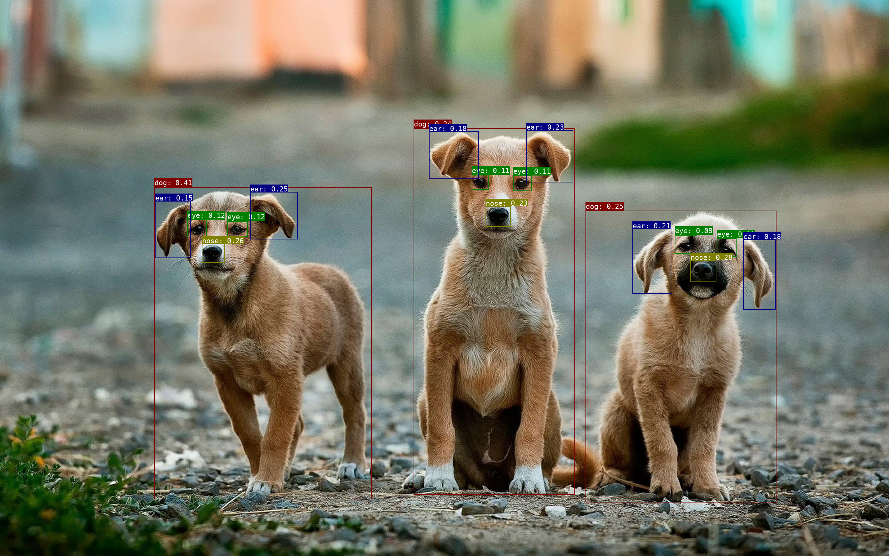

<div align="center">
  <h1>yolo-world-onnx</h1>
  <a href="#installation"><b>Installation</b></a>
  | <a href="#usage"><b>Usage</b></a>
  | <a href="#license"><b>License</b></a>
</div>

<br/>

<div align="center">
    
</div>

## ONNX Models

[Download](https://github.com/wkentaro/yolo-world-onnx/releases/latest)

## Installation

Option 1: Install all for PyTorch inference, export, and ONNX inference:

```
make install
```

Option 2: Install only for ONNX inference:

```
make install_for_onnx
```

## Usage

### Inference with PyTorch

Run inference using the PyTorch pre-trained model:

```
./infer_pytorch.py
./infer_pytorch.py --class-names person,shoes
./infer_pytorch.py --image-file data/images/dogs.jpg \
                   --class-names dog,eye,nose,ear,tail \
                   --iou-threshold 0.5 \
                   --score-threshold 0.09
```

### Export ONNX

Export YOLO-World and NMS models to ONNX format:

```
./export_onnx.py
./export_nms_onnx.py
```

### Inference with ONNX

Run inference using the exported ONNX model:

```
./infer_onnx.py
./infer_onnx.py --class-names person,shoes
./infer_onnx.py --image-file data/images/dogs.jpg \
                --class-names dog,eye,nose,ear,tail \
                --iou-threshold 0.5 \
                --score-threshold 0.09
```

## Acknowledgements

YOLO-World is an open-vocabulary object detection model published in CVPR2024.

Check out the following resources for more information: [Paper](https://arxiv.org/abs/2401.17270), [Code](https://github.com/AILab-CVC/YOLO-World)

## License

GPLv3
